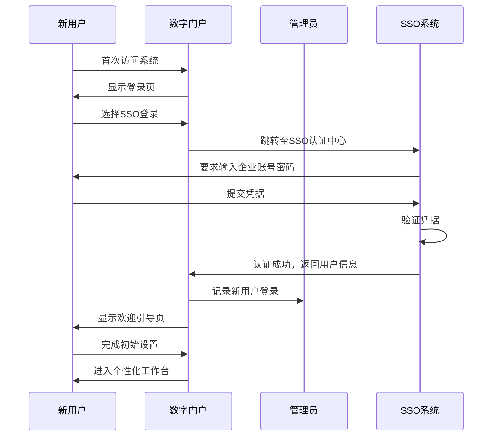
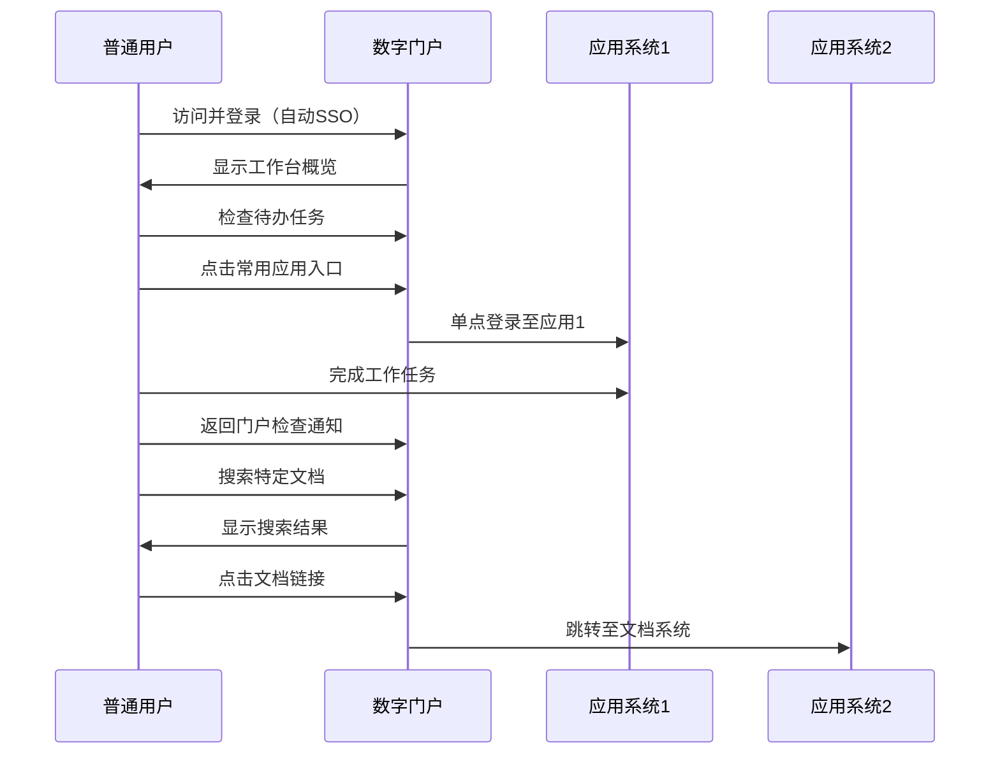

# XY Work 统一数字门户 - 用户体验设计方案

## 1. 用户旅程设计

### 1.1 新用户入职旅程

### 1.2 日常工作使用旅程

## 2. 交互模式设计

### 2.1 导航模式

**桌面端**：
- 顶部全局导航栏（固定）
  - Logo/系统名称
  - 全局搜索框
  - 消息通知
  - 用户头像/下拉菜单
- 左侧功能导航栏（可折叠）
  - 当前模块功能菜单
  - 面包屑导航显示当前层级
- 主内容区域
  - 自适应宽度布局

**移动端**：
- 顶部导航栏（简化）
  - 汉堡菜单按钮
  - Logo/系统名称
  - 消息通知图标
- 侧边抽屉式菜单（点击展开）
- 底部导航栏（核心功能快捷入口）

### 2.2 交互反馈机制

- **操作成功**：
  - 顶部右侧轻量级成功提示（3秒自动消失）
  - 操作区域视觉反馈（如保存按钮状态变化）

- **操作失败**：
  - 顶部右侧错误提示（可手动关闭）
  - 表单验证错误实时显示在字段下方

- **加载状态**：
  - 页面级别加载：骨架屏（Skeleton）
  - 区域级别加载：加载指示器（Spinner）
  - 按钮点击：状态变化+加载图标

- **确认操作**：
  - 重要操作（删除、提交等）：模态对话框确认
  - 批量操作：二次确认提示

## 3. 关键场景设计

### 3.1 个性化工作台

**功能目标**：提供定制化的工作入口和信息聚合，提升工作效率

**布局设计**：
- 顶部区域：欢迎信息 + 快捷操作栏
- 中部区域：
  - 左侧：系统入口网格（可拖拽排序）
  - 右侧：待办任务列表 + 通知消息流
- 底部区域：快速访问统计数据和最近活动

**交互特性**：
- 入口卡片悬停效果（轻微放大+阴影增强）
- 拖放操作支持自定义排序
- 入口搜索和分类筛选
- 任务卡片展开/折叠详情
- 消息标记已读/未读

### 3.2 系统入口管理（管理员）

**功能目标**：灵活配置和管理所有系统入口，控制访问权限

**布局设计**：
- 顶部操作栏：搜索、筛选、批量操作、添加入口按钮
- 中部数据表格：
  - 支持列排序、筛选
  - 每行操作按钮（编辑、删除、权限设置）
- 分页控件：底部完整分页功能
- 右侧抽屉：点击编辑时滑出详情表单

**交互特性**：
- 表格行悬停高亮
- 批量选择和操作
- 拖放调整列顺序
- 编辑表单即时验证
- 权限配置可视化（角色选择器）

### 3.3 全局搜索体验

**功能目标**：提供快速精准的内容搜索，支持多类型结果展示

**交互流程**：
1. 用户点击搜索框或按Ctrl+K快捷键
2. 显示搜索历史和热门搜索建议
3. 用户输入关键词，实时显示搜索结果预览
4. 结果分类展示（系统入口、文档、通知等）
5. 点击建议项直接跳转或按回车查看完整结果页

**设计细节**：
- 搜索框获得焦点时自动展开建议面板
- 结果预览显示标题、摘要和来源
- 支持通过Tab键在搜索结果中导航
- 搜索结果页支持进一步筛选和排序

## 4. 用户体验优化策略

### 4.1 性能优化

- **首屏加载时间** < 2秒
- **关键操作响应时间** < 300ms
- **懒加载**：非首屏内容和图像
- **组件缓存**：常用组件状态保持
- **资源预加载**：预测用户可能访问的资源

### 4.2 可访问性设计

- 符合WCAG 2.1 AA级标准
- 支持键盘导航（Tab顺序合理）
- 所有交互元素有足够的点击区域（≥44×44px）
- 色彩对比度符合要求（文本与背景≥4.5:1）
- 提供足够的色彩外的区分方式（图标、形状等）

### 4.3 无障碍设计

- 屏幕阅读器兼容性支持
- 表单标签与输入字段关联
- 错误提示提供明确指导
- 支持高对比度模式
- 文本大小调整不破坏布局

## 5. 设计规范与组件复用

### 5.1 交互设计模式库

| 交互模式 | 应用场景 | 设计规范 |
|---------|---------|--------|
| 模态对话框 | 重要操作确认、表单编辑 | 居中显示，背景模糊，可通过ESC关闭 |
| 侧边抽屉 | 详情查看、辅助功能 | 从右侧滑出，宽度固定，可通过点击外部关闭 |
| 通知提示 | 操作反馈、系统通知 | 顶部右侧显示，3-5秒自动消失 |
| 标签页切换 | 同类内容分组展示 | 内容区切换平滑过渡，当前标签高亮 |
| 手风琴面板 | 内容展开/折叠 | 一次只允许一个面板展开，动画过渡 |

### 5.2 微交互设计

- **按钮状态变化**：
  - 正常/悬停/点击/禁用四态
  - 点击时有轻微下沉效果
  - 加载时显示进度指示

- **表单交互**：
  - 输入验证实时反馈
  - 焦点状态清晰可见
  - 错误状态视觉明确

- **数据更新**：
  - 数字变化有计数动画
  - 列表项添加/删除有过渡效果
  - 状态切换有平滑动画

## 6. 多端适配策略

### 6.1 响应式断点规范

| 设备类型 | 屏幕宽度 | 布局策略 |
|---------|---------|--------|
| 移动设备 | < 768px | 单列布局，底部导航，汉堡菜单 |
| 平板设备 | 768px - 1199px | 双列布局，侧边栏可折叠 |
| 桌面设备 | ≥ 1200px | 三列布局，完整功能展示 |

### 6.2 关键页面适配

**工作台适配**：
- 桌面端：网格布局，多列展示
- 平板端：减少列数，优化间距
- 移动端：单列滚动，关键功能优先

**管理页面适配**：
- 桌面端：完整表格，多列数据
- 平板端：精简表格，横向滚动
- 移动端：列表卡片化，详情页展示

## 7. 用户测试与迭代计划

### 7.1 测试方法

- **用户访谈**：收集定性反馈
- **可用性测试**：观察用户完成任务的过程
- **A/B测试**：对比不同设计方案
- **数据分析**：用户行为数据统计

### 7.2 迭代优化

- **第一阶段**：基础功能验证
  - 验证核心流程的可用性
  - 收集用户反馈

- **第二阶段**：体验优化
  - 改进交互细节
  - 优化性能表现

- **第三阶段**：功能增强
  - 添加个性化功能
  - 提升用户体验

## 8. 附录

### 8.1 设计原则

- **简洁明了**：减少认知负担，突出核心功能
- **一致性**：统一交互模式和视觉语言
- **高效实用**：优化操作路径，提升工作效率
- **可访问性**：确保所有用户都能使用系统
- **可扩展性**：支持未来功能扩展

### 8.2 设计资源

- 组件设计稿：[Figma/Axure链接]
- 交互原型：[可交互原型链接]
- 用户流程图：[流程图链接]