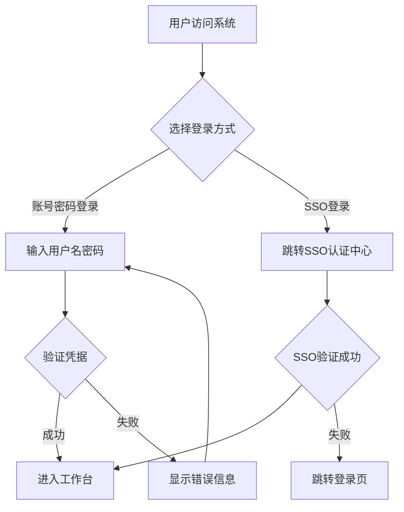
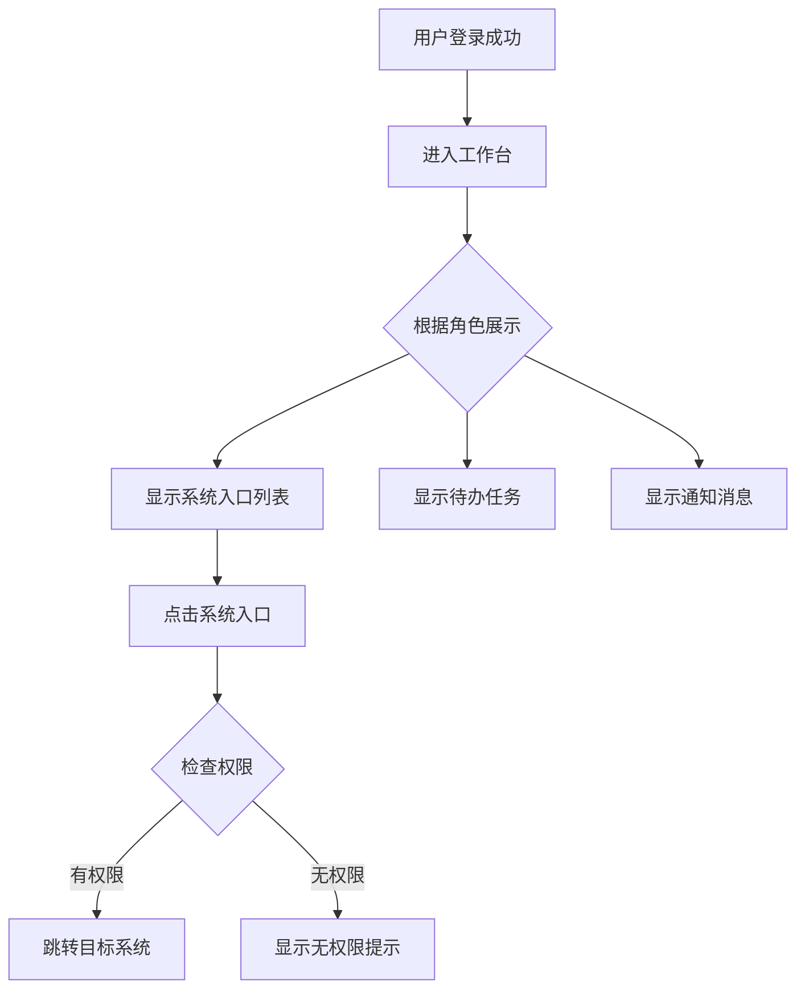
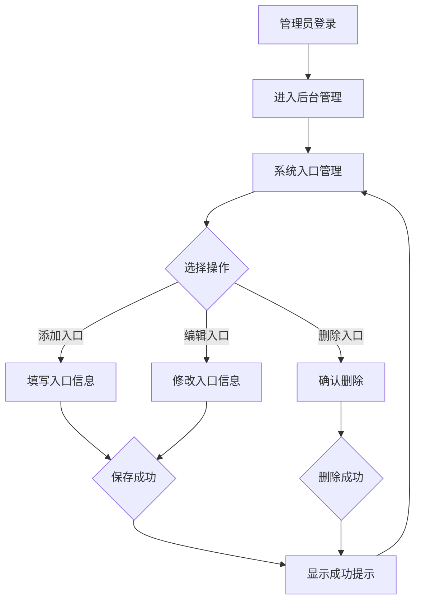
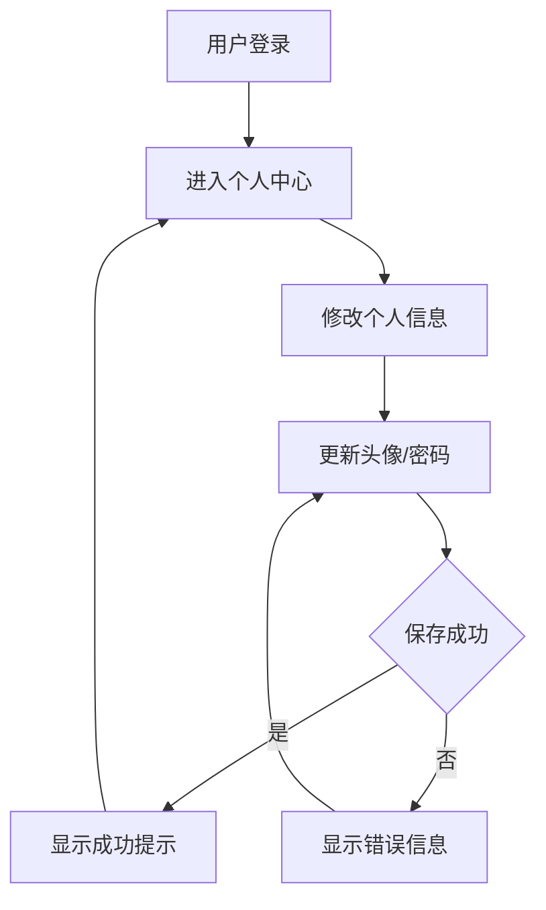
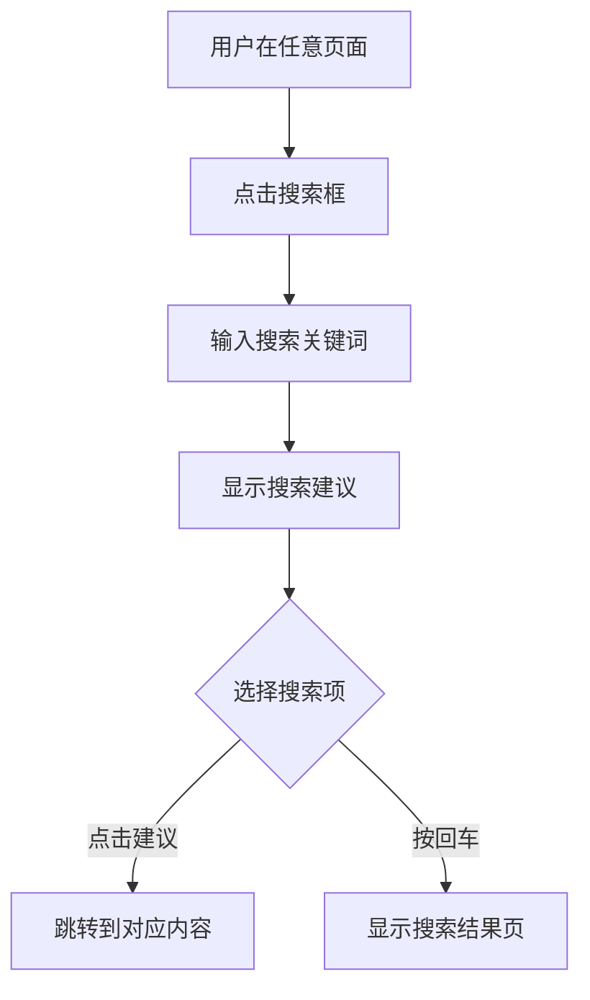

# XY Work 统一数字门户 - 用户流程图

## 1. 登录流程

```mermaid
flowchart TD
    A[用户访问系统] --> B{选择登录方式}
    B -->|账号密码登录| C[输入用户名密码]
    B -->|SSO登录| D[跳转SSO认证中心]
    C --> E{验证凭据}
    D --> F{SSO验证成功}
    E -->|成功| G[进入工作台]
    E -->|失败| H[显示错误信息]
    F --> G
    F -->|失败| I[跳转登录页]
    H --> C
```

## 2. 工作台访问流程

```mermaid
flowchart TD
    A[用户登录成功] --> B[进入工作台]
    B --> C{根据角色展示}
    C --> D[显示系统入口列表]
    C --> E[显示待办任务]
    C --> F[显示通知消息]
    D --> G[点击系统入口]
    G --> H{检查权限}
    H -->|有权限| I[跳转目标系统]
    H -->|无权限| J[显示无权限提示]
```

## 3. 系统入口管理流程

```mermaid
flowchart TD
    A[管理员登录] --> B[进入后台管理]
    B --> C[系统入口管理]
    C --> D{选择操作}
    D -->|添加入口| E[填写入口信息]
    D -->|编辑入口| F[修改入口信息]
    D -->|删除入口| G[确认删除]
    E --> H{保存成功}
    F --> H
    G --> I{删除成功}
    H --> J[显示成功提示]
    I --> J
    J --> C
```

## 4. 用户信息管理流程

```mermaid
flowchart TD
    A[用户登录] --> B[进入个人中心]
    B --> C[修改个人信息]
    C --> D[更新头像/密码]
    D --> E{保存成功}
    E -->|是| F[显示成功提示]
    E -->|否| G[显示错误信息]
    F --> B
    G --> D
```

## 5. 全局搜索流程

```mermaid
flowchart TD
    A[用户在任意页面] --> B[点击搜索框]
    B --> C[输入搜索关键词]
    C --> D[显示搜索建议]
    D --> E{选择搜索项}
    E -->|点击建议| F[跳转到对应内容]
    E -->|按回车| G[显示搜索结果页]
```