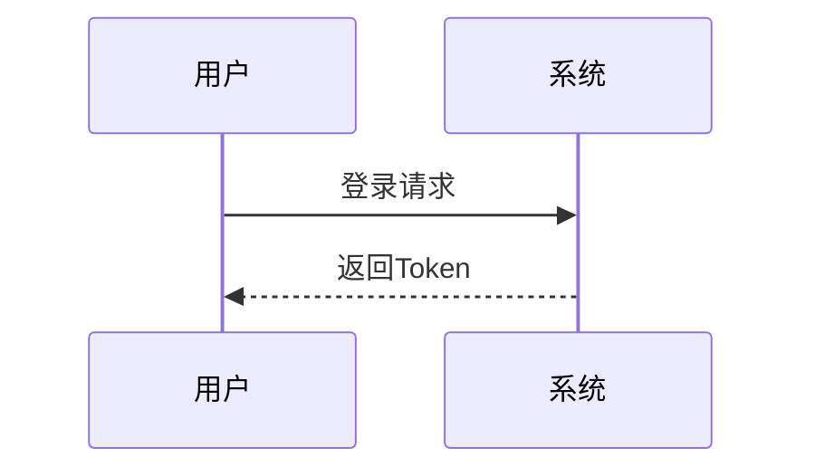
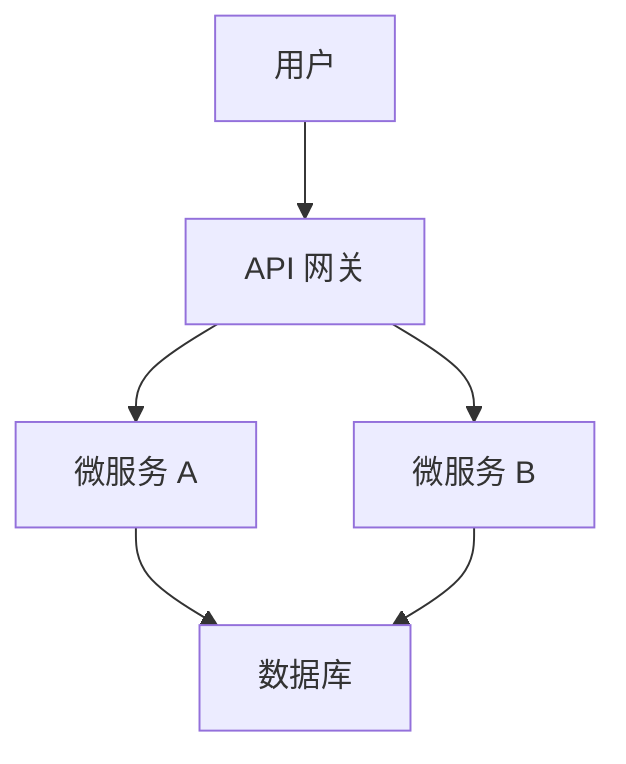
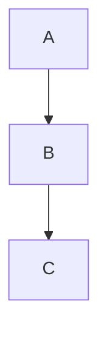

# 文档规范（Documentation Style）

## 1. 语言与格式
- 中文为主，关键术语附英文；日期 `YYYY-MM-DD`
- Markdown 编写，标题分级清晰；避免超长段落
- **代码块**：
  - 使用 ``` 包裹代码块
  - 明确指定语言类型（如 ```javascript, ```sql）
  - 重要代码块添加注释说明
  - 避免超过 50 行的代码块，考虑拆分为多个小代码块
- **图片**：
  - 使用相对路径（如 `../assets/images/xxx.png`）
  - 图片添加 alt 文本说明
  - 图片大小适中，避免过大文件
  - 关键图片添加标题和编号

## 2. 结构模板
- README：目的、结构、快速开始、维护者
- 需求文档：背景、范围、流程、功能清单、NFR、验收
- 变更记录：时间、变更项、影响范围、回滚方案

## 3. 链接与引用
- 使用相对路径链接仓库内文档
- 外链标注来源与访问时间

## 4. 评审与归档
- 文档 PR 需评审；版本化与标签化归档

## 5. 文档模板库

### 5.1 README 模板
```markdown
# 项目名称（Project Name）

## 项目简介
- 简明扼要的项目描述
- 主要功能/亮点
- 典型应用场景

## 目录结构
```
├── src/           # 源代码目录
├── docs/          # 文档目录
├── tests/         # 测试目录
├── examples/      # 示例代码
└── README.md      # 项目说明文档
```

## 快速开始

### 前置条件
- Node.js v14+
- npm v6+

### 安装
```bash
npm install
```

### 开发
```bash
npm run dev
```

### 构建
```bash
npm run build
```

## 文档
- [用户指南](docs/user-guide.md)
- [API 文档](docs/api.md)
- [开发指南](docs/developer-guide.md)

## 测试
```bash
npm test
```

## 贡献指南
见 [CONTRIBUTING.md](CONTRIBUTING.md)

## 许可证
[MIT](LICENSE)

## 维护者
- 张三（zhangsan@example.com）
- 李四（lisi@example.com）
```

### 5.2 需求文档模板
```markdown
# 需求文档：[功能名称]

## 1. 背景与目标
- 需求来源
- 解决的问题
- 预期成果

## 2. 业务范围
- 包含的功能点
- 不包含的功能点
- 与其他系统的交互

## 3. 用户故事/业务流程
### 3.1 用户故事
- 作为 [角色]，我希望 [功能]，以便 [价值]

### 3.2 业务流程图


## 4. 功能需求（Functional Requirements）
| 编号 | 功能点 | 用户故事 | 输入/输出 | 详细说明 | 验收标准 |
|-----|-------|---------|----------|---------|--------|
| FR-01 | 登录 | 作为... | 用户名/密码 -> Token | 支持用户名密码登录 | 能正确登录并返回Token |

## 5. 非功能需求（Non-Functional Requirements）
| 类别 | 要求 | 验收标准 |
|-----|-----|--------|
| 性能 | 页面加载时间 < 2s | 实际测试加载时间 |
| 安全性 | 敏感数据加密 | 安全测试通过 |
| 可用性 | 99.9% 可用性 | 监控数据达标 |

## 6. 数据需求
- 数据结构
- 存储方式
- 数据流转

## 7. 验收标准（Acceptance Criteria）
- 所有功能点完成
- 性能指标达标
- 安全合规

## 8. 风险与依赖
- 已识别的风险
- 外部依赖
- 缓解措施

## 9. 进度计划
- 计划开始时间
- 里程碑
- 交付物

## 10. 相关文档
- [产品原型](https://example.com/prototype)
- [技术方案](docs/tech-doc.md)
```

### 5.3 技术文档模板
```markdown
# 技术方案：[功能名称]

## 1. 概述
- 功能简介
- 设计目标
- 技术挑战

## 2. 架构设计
### 2.1 系统架构图


### 2.2 组件关系
- 组件 A 的职责
- 组件 B 的职责
- 交互方式

## 3. 技术选型
| 类别 | 技术/框架 | 版本 | 选型理由 |
|-----|----------|-----|--------|
| 后端 | Spring Boot | 2.7 | 成熟稳定，生态丰富 |
| 数据库 | MySQL | 8.0 | 关系型数据库，事务支持 |
| 缓存 | Redis | 6.0 | 高性能缓存 |

## 4. 详细设计

### 4.1 核心类/函数
| 类/函数名 | 说明 | 参数（类型/含义） | 返回值 | 备注 |
|---------|-----|-----------------|-------|------|
| UserService.getUserById | 获取用户信息 | id: Long 用户ID | User 对象 | 包含用户详情 |

### 4.2 数据模型
```java
@Entity
public class User {
    @Id
    private Long id;
    private String name;
    private String email;
    // getter and setter
}
```

### 4.3 API 设计
| API | 方法 | 模块 | 功能描述 | 请求体 (JSON) | 成功响应 (200 OK) |
|-----|-----|------|---------|--------------|----------------|
| /api/users | GET | 用户模块 | 获取用户列表 | N/A | `{"data": [...], "total": 100}` |

### 4.4 数据库设计
#### 表结构
**users 表**
| 字段名 | 数据类型 | 约束 | 描述 |
|-------|---------|-----|------|
| id | BIGINT | PRIMARY KEY | 用户ID |
| name | VARCHAR(50) | NOT NULL | 用户名 |
| email | VARCHAR(100) | UNIQUE NOT NULL | 邮箱 |
| created_at | DATETIME | NOT NULL | 创建时间 |
| updated_at | DATETIME | NOT NULL | 更新时间 |

#### 索引设计
- users 表：name, email 字段建立索引

## 5. 部署与集成

### 5.1 部署架构
- 开发环境
- 测试环境
- 生产环境

### 5.2 集成方案
- 与服务 A 集成
- 与服务 B 集成

## 6. 测试策略

### 6.1 单元测试
- 关键业务逻辑
- 边界条件

### 6.2 集成测试
- API 接口测试
- 服务间集成测试

## 7. 性能优化
- 缓存策略
- 数据库优化
- 并发处理

## 8. 风险与应对
- 潜在风险
- 应对措施

## 9. 变更记录
| 日期 | 版本 | 变更内容 | 变更人 |
|-----|-----|---------|-------|
| 2024-01-01 | v1.0 | 初始版本 | 张三 |

## 10. 参考文档
- [Spring Boot 文档](https://spring.io/guides/gs/spring-boot)
```

## 6. 文档更新流程

### 6.1 更新触发
- 功能新增或修改
- 技术栈变更
- 发现文档错误或不完整
- 定期审查更新

### 6.2 更新流程
1. **创建文档更新任务**：
   - 明确更新范围和内容
   - 指定负责人和截止时间
   - 评估是否需要多人协作

2. **更新文档**：
   - 遵循文档模板和规范
   - 使用 Markdown 格式编写
   - 添加必要的代码示例、图表和图片
   - 更新相关引用和链接

3. **内部审查**：
   - 团队成员内部审查
   - 检查准确性、完整性和格式
   - 收集反馈并修改

4. **提交 PR**：
   - 创建专门的文档更新 PR
   - 提供详细的变更说明
   - 关联相关的功能或任务

5. **正式评审**：
   - 相关领域专家评审
   - 确认内容符合要求
   - 最终批准或提出修改意见

6. **合并发布**：
   - 合并 PR 到主分支
   - 更新文档版本号
   - 通知相关团队和用户

### 6.3 更新规范
- **版本控制**：文档版本与代码版本保持一致
- **变更记录**：每次更新必须记录变更内容
- **时效性**：功能上线前完成相关文档更新
- **准确性**：确保文档内容与实际代码和功能一致

## 7. 文档质量标准

### 7.1 内容质量
- **准确性**：内容必须准确无误，与实际情况一致
- **完整性**：覆盖所有必要的信息，不遗漏关键细节
- **及时性**：内容保持最新，反映当前系统状态
- **清晰度**：表达清晰，易于理解

### 7.2 格式质量
- **一致性**：遵循统一的文档格式和风格指南
- **可读性**：排版合理，重点突出
- **结构良好**：层次分明，逻辑清晰
- **专业外观**：格式规范，无拼写和语法错误

### 7.3 技术质量
- **链接有效**：所有链接必须有效且最新
- **代码正确**：示例代码可以正常运行
- **图片清晰**：图表和图片清晰可读
- **示例完整**：提供完整的使用示例

### 7.4 评估指标
- **用户满意度**：定期收集用户对文档的反馈
- **文档覆盖率**：重要功能和API的文档覆盖情况
- **更新及时性**：文档更新与代码更新的同步程度
- **问题解决率**：文档能够解决的用户问题比例

## 8. 文档工具与最佳实践

### 8.1 推荐工具
- **文档编写**：Visual Studio Code + Markdown 插件
- **图表生成**：Mermaid, Draw.io, Excalidraw
- **版本控制**：Git + GitHub/GitLab
- **文档托管**：GitHub Pages, GitLab Pages, MkDocs
- **协作工具**：Confluence, Notion

### 8.2 最佳实践
- **模块化**：将大型文档拆分为多个小型、专注的文档
- **重用内容**：使用引用或包含机制避免重复内容
- **实时预览**：使用支持实时预览的编辑工具
- **自动化**：使用工具自动生成部分文档（如API文档）
- **审查机制**：建立文档审查机制确保质量

### 8.3 常见问题与解决方案
- **文档过时**：建立定期审查和更新机制
- **内容不一致**：指定文档负责人，统一管理
- **难以维护**：使用模板和自动化工具简化维护
- **缺乏反馈**：建立反馈渠道，持续改进文档

## 9. Markdown 语法指南

### 9.1 基础语法
- **标题**：`# 一级标题`, `## 二级标题`, 最多支持 6 级
- **列表**：
  - 无序列表：`- 项目` 或 `* 项目`
  - 有序列表：`1. 项目`
- **链接**：`[链接文本](URL)`
- **图片**：``
- **强调**：`*斜体*`, `**粗体**`, `***粗斜体***`
- **代码**：行内代码 `` `code` ``, 代码块 ```language 代码 ```

### 9.2 高级语法
- **表格**：
```markdown
| 表头 | 表头 |
|-----|------|
| 单元格 | 单元格 |
| 单元格 | 单元格 |
```

- **引用**：`> 引用文本`

- **分割线**：`---` 或 `***`

- **任务列表**：
```markdown
- [x] 已完成任务
- [ ] 未完成任务
```

- **Mermaid 图表**：


### 9.3 格式规范
- 使用空格提高可读性（标题后、列表项后等）
- 保持一致的缩进（建议使用 2 或 4 个空格）
- 避免过长的行（建议每行不超过 80 个字符）
- 使用空行分隔不同的内容块

